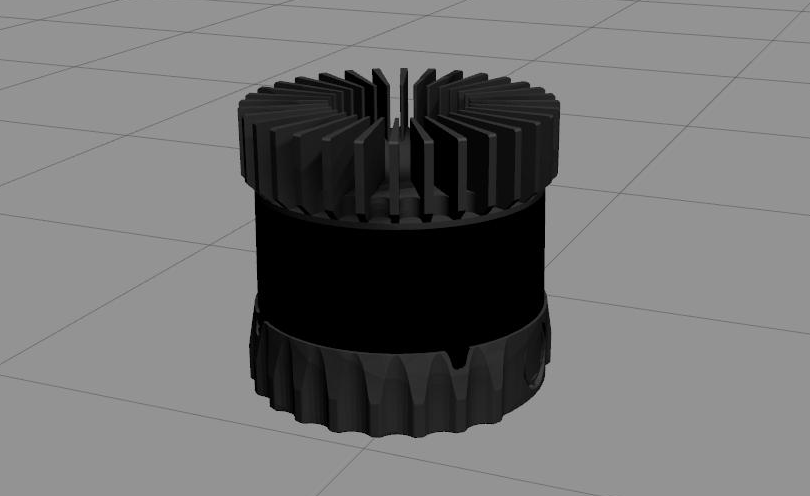
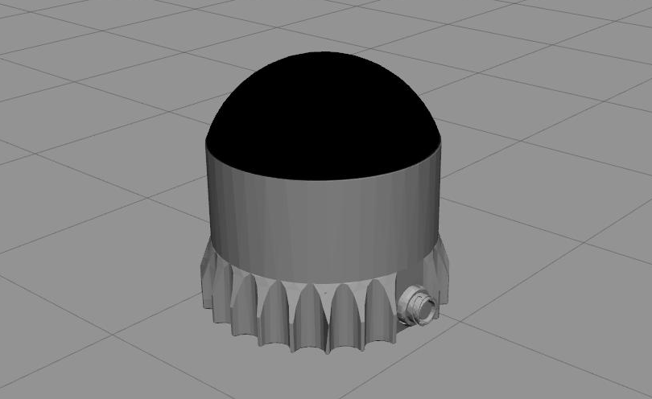
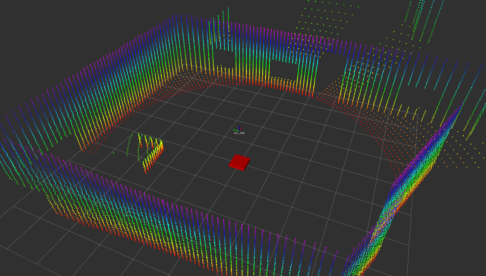
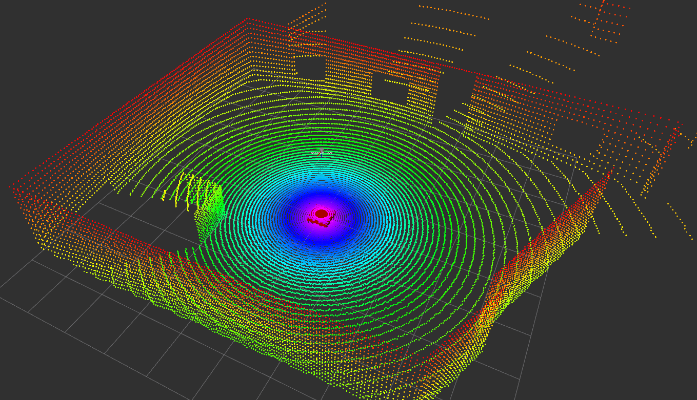

# OS1-64 and OSDome LiDAR Simulation in Gazebo

## Introduction

This repository is a fork of the original [Ouster Example Repository](https://github.com/wilselby/ouster_example). It extends the Gazebo simulation models to include support for the [OSDome sensor](https://ouster.com/jp/products/scanning-lidar/osdome-sensor/).

<p align="center">
  
  &nbsp; &nbsp; &nbsp; &nbsp;
  
</p>

<p align="center">
  
  &nbsp; &nbsp; &nbsp; &nbsp;
  
</p>


## Additional Features

- **GPU Acceleration**: This fork adds support for GPU acceleration, enhancing simulation efficiency and speed.
- **Per-Point Timestamps**: The point cloud data now includes a `t` field, simulating the timestamp for each point. This is achieved by evenly dividing the time from the start to the end of a single scan.
- **Extended SDF Files**: Additional `.sdf` files have been added to `ouster_description/models` for Gazebo simulation.

## Installation

To install, clone the repository and build it using `catkin build`:

```bash
cd your_workspace
git clone https://github.com/tucasa/ouster_example.git
cd ouseter_example
catkin build
```

## Usage Examples

### OS1-64

To launch the Gazebo simulation with the OS1-64 model, use:

```bash
roslaunch ouster_description os1_world.launch
```

### OSDome

To launch the Gazebo simulation with the OSDome model, use:

```bash
roslaunch ouster_description osdome_world.launch
```

### GPU Support

To enable GPU acceleration, add the `gpu:=true` argument to the roslaunch command.

## References

The CAD model for the OSDome sensor can be found on Ouster's [official page](https://ouster.com/downloads/).

